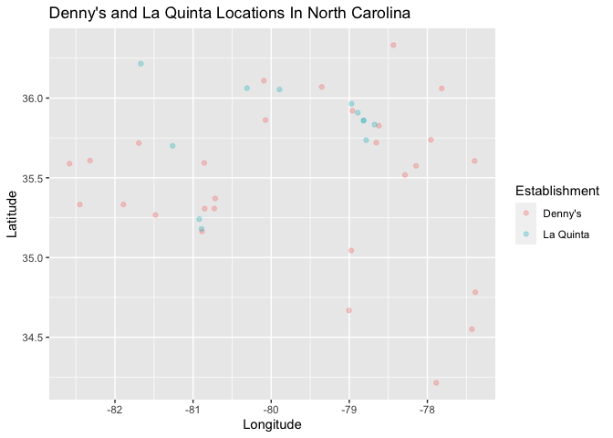
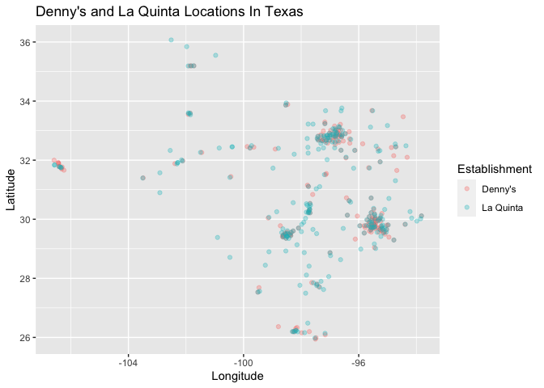

Lab 04 - Visualizing spatial data
================
Cynthia Deng
02/06/2026

### Load packages and data

``` r
library(tidyverse) 
library(dsbox) 
```

``` r
states <- read_csv("data/states.csv")
data(dennys)
data(laquinta)
```

``` r
summary(states)
```

    ##      name           abbreviation            area         
    ##  Length:51          Length:51          Min.   :    68.3  
    ##  Class :character   Class :character   1st Qu.: 35899.6  
    ##  Mode  :character   Mode  :character   Median : 56272.8  
    ##                                        Mean   : 74445.9  
    ##                                        3rd Qu.: 84232.9  
    ##                                        Max.   :665384.0

``` r
summary(dennys)
```

    ##    address              city              state               zip           
    ##  Length:1643        Length:1643        Length:1643        Length:1643       
    ##  Class :character   Class :character   Class :character   Class :character  
    ##  Mode  :character   Mode  :character   Mode  :character   Mode  :character  
    ##                                                                             
    ##                                                                             
    ##                                                                             
    ##    longitude          latitude    
    ##  Min.   :-158.09   Min.   :19.65  
    ##  1st Qu.:-117.33   1st Qu.:33.00  
    ##  Median : -96.84   Median :36.05  
    ##  Mean   : -99.60   Mean   :36.36  
    ##  3rd Qu.: -82.65   3rd Qu.:40.09  
    ##  Max.   : -68.42   Max.   :64.84

``` r
summary(laquinta)
```

    ##    address              city              state               zip           
    ##  Length:909         Length:909         Length:909         Length:909        
    ##  Class :character   Class :character   Class :character   Class :character  
    ##  Mode  :character   Mode  :character   Mode  :character   Mode  :character  
    ##                                                                             
    ##                                                                             
    ##                                                                             
    ##    longitude          latitude     
    ##  Min.   :-149.91   Min.   : 6.225  
    ##  1st Qu.:-100.48   1st Qu.:30.475  
    ##  Median : -95.27   Median :34.082  
    ##  Mean   : -94.79   Mean   :35.038  
    ##  3rd Qu.: -84.35   3rd Qu.:39.199  
    ##  Max.   : -70.28   Max.   :64.824

### Exercise 1

``` r
nrow(dennys)
```

    ## [1] 1643

``` r
ncol(dennys)
```

    ## [1] 6

The Denny’s dataset has 1643 rows and 6 columns. Each row represent a
single Denny’s location, including variables such as address, city,
state, zipcode, longitude, and latitude.

### Exercise 2

``` r
nrow(laquinta)
```

    ## [1] 909

``` r
ncol(laquinta)
```

    ## [1] 6

The La Quinta dataset has 909 rows and 6 columns. Each row represent a
single La Quinta location, including variables such as address, city,
state, zipcode, longitude, and latitude.

### Exercise 3

There are no Denny’s outside of the U.S.. However, there are La Quinta
hotels in Canada, Mexico, China, New Zealand, Europe (Georgia, Turkiye),
United Arab Emirates, and South America (Colombia, Ecuador)

### Exercise 4

Some ideas I can think of are looking over the zip code, if the zipcode
does not match the U.S. zipcode format, then the location is probably
outside of the U.S.. We can also check the longitude and latitude to see
if it is in the range of of the U.S.. Another option is to check the
states variable to see whether or not the abbreviated state match U.S.
states.

### Exercise 5

``` r
dennys %>%
  filter(!(state %in% states$abbreviation))
```

    ## # A tibble: 0 × 6
    ## # ℹ 6 variables: address <chr>, city <chr>, state <chr>, zip <chr>,
    ## #   longitude <dbl>, latitude <dbl>

there is no Denny’s locataion outside of the stats

### Exercise 6

``` r
dennys %>%
  mutate(country = "United States")
```

    ## # A tibble: 1,643 × 7
    ##    address                        city    state zip   longitude latitude country
    ##    <chr>                          <chr>   <chr> <chr>     <dbl>    <dbl> <chr>  
    ##  1 2900 Denali                    Anchor… AK    99503    -150.      61.2 United…
    ##  2 3850 Debarr Road               Anchor… AK    99508    -150.      61.2 United…
    ##  3 1929 Airport Way               Fairba… AK    99701    -148.      64.8 United…
    ##  4 230 Connector Dr               Auburn  AL    36849     -85.5     32.6 United…
    ##  5 224 Daniel Payne Drive N       Birmin… AL    35207     -86.8     33.6 United…
    ##  6 900 16th St S, Commons on Gree Birmin… AL    35294     -86.8     33.5 United…
    ##  7 5931 Alabama Highway, #157     Cullman AL    35056     -86.9     34.2 United…
    ##  8 2190 Ross Clark Circle         Dothan  AL    36301     -85.4     31.2 United…
    ##  9 900 Tyson Rd                   Hope H… AL    36043     -86.4     32.2 United…
    ## 10 4874 University Drive          Huntsv… AL    35816     -86.7     34.7 United…
    ## # ℹ 1,633 more rows

### Exercise 7

``` r
laquinta %>%
  filter(!(state %in% states$abbreviation))
```

    ## # A tibble: 14 × 6
    ##    address                                  city  state zip   longitude latitude
    ##    <chr>                                    <chr> <chr> <chr>     <dbl>    <dbl>
    ##  1 Carretera Panamericana Sur KM 12         "\nA… AG    20345    -102.     21.8 
    ##  2 Av. Tulum Mza. 14 S.M. 4 Lote 2          "\nC… QR    77500     -86.8    21.2 
    ##  3 Ejercito Nacional 8211                   "Col… CH    32528    -106.     31.7 
    ##  4 Blvd. Aeropuerto 4001                    "Par… NL    66600    -100.     25.8 
    ##  5 Carrera 38 # 26-13 Avenida las Palmas c… "\nM… ANT   0500…     -75.6     6.22
    ##  6 AV. PINO SUAREZ No. 1001                 "Col… NL    64000    -100.     25.7 
    ##  7 Av. Fidel Velazquez #3000 Col. Central   "\nM… NL    64190    -100.     25.7 
    ##  8 63 King Street East                      "\nO… ON    L1H1…     -78.9    43.9 
    ##  9 Calle Las Torres-1 Colonia Reforma       "\nP… VE    93210     -97.4    20.6 
    ## 10 Blvd. Audi N. 3 Ciudad Modelo            "\nS… PU    75010     -97.8    19.2 
    ## 11 Ave. Zeta del Cochero No 407             "Col… PU    72810     -98.2    19.0 
    ## 12 Av. Benito Juarez 1230 B (Carretera 57)… "\nS… SL    78399    -101.     22.1 
    ## 13 Blvd. Fuerza Armadas                     "con… FM    11101     -87.2    14.1 
    ## 14 8640 Alexandra Rd                        "\nR… BC    V6X1…    -123.     49.2

The La Quinta hotels that are outside of the U.S. are in Mexico,
Colombia, Canada, and Honduras \### Exercise 8

``` r
laquinta_country <- laquinta %>%
  mutate(country = case_when(
    state %in% state.abb ~ "United States",
    state %in% c("ON", "BC") ~ "Canada",
    state == "ANT" ~ "Colombia",
    state == "FM" ~ "Honduras",
    state %in% c("AG", "CH", "PU", "SL", "QR", "NL", "VE") ~ "Mexico"
  ))
```

### Exercise 9

``` r
dennys %>%
  count(state) %>%
  arrange(desc(n))
```

    ## # A tibble: 51 × 2
    ##    state     n
    ##    <chr> <int>
    ##  1 CA      403
    ##  2 TX      200
    ##  3 FL      140
    ##  4 AZ       83
    ##  5 IL       56
    ##  6 NY       56
    ##  7 WA       49
    ##  8 OH       44
    ##  9 MO       42
    ## 10 PA       40
    ## # ℹ 41 more rows

California has the most Denny’s and Delaware has the least.

``` r
laquinta_country %>%
  filter (country == "United States") %>%
  count(state) %>%
  arrange(desc(n))
```

    ## # A tibble: 48 × 2
    ##    state     n
    ##    <chr> <int>
    ##  1 TX      237
    ##  2 FL       74
    ##  3 CA       56
    ##  4 GA       41
    ##  5 TN       30
    ##  6 OK       29
    ##  7 LA       28
    ##  8 CO       27
    ##  9 NM       19
    ## 10 NY       19
    ## # ℹ 38 more rows

Texas has the most La Quinta and Maine has the least. These results are
not suprsing, since the CA and Texas are larger states while Delaware
and Maine are small states

### Exercise 10

``` r
dennys %>%
  count(state) %>%
  inner_join(states, by = c("state" = "abbreviation")) %>%
  mutate(per1000 = n / (area / 1000)) %>% 
  arrange(desc(per1000))
```

    ## # A tibble: 51 × 5
    ##    state     n name                     area per1000
    ##    <chr> <int> <chr>                   <dbl>   <dbl>
    ##  1 DC        2 District of Columbia     68.3  29.3  
    ##  2 RI        5 Rhode Island           1545.    3.24 
    ##  3 CA      403 California           163695.    2.46 
    ##  4 CT       12 Connecticut            5543.    2.16 
    ##  5 FL      140 Florida               65758.    2.13 
    ##  6 MD       26 Maryland              12406.    2.10 
    ##  7 NJ       10 New Jersey             8723.    1.15 
    ##  8 NY       56 New York              54555.    1.03 
    ##  9 IN       37 Indiana               36420.    1.02 
    ## 10 OH       44 Ohio                  44826.    0.982
    ## # ℹ 41 more rows

DC has the most Denny’s per 1000 sq miles.

``` r
laquinta_country %>%
  count(state) %>%
  inner_join(states, by = c("state" = "abbreviation")) %>%
  mutate(per1000 = n / (area / 1000)) %>% 
  arrange(desc(per1000))
```

    ## # A tibble: 48 × 5
    ##    state     n name             area per1000
    ##    <chr> <int> <chr>           <dbl>   <dbl>
    ##  1 RI        2 Rhode Island    1545.   1.29 
    ##  2 FL       74 Florida        65758.   1.13 
    ##  3 CT        6 Connecticut     5543.   1.08 
    ##  4 MD       13 Maryland       12406.   1.05 
    ##  5 TX      237 Texas         268596.   0.882
    ##  6 TN       30 Tennessee      42144.   0.712
    ##  7 GA       41 Georgia        59425.   0.690
    ##  8 NJ        5 New Jersey      8723.   0.573
    ##  9 MA        6 Massachusetts  10554.   0.568
    ## 10 LA       28 Louisiana      52378.   0.535
    ## # ℹ 38 more rows

Rhode Island has the most La Quinta per 1000 sq miles

``` r
dennys <- dennys %>%
  mutate(establishment = "Denny's")
laquinta_country <- laquinta_country %>%
  mutate(establishment = "La Quinta")
dn_lq <- bind_rows(dennys, laquinta_country)
```

``` r
ggplot(dn_lq, mapping = aes(
  x = longitude,
  y = latitude,
  color = establishment
)) +
  geom_point()
```

<!-- -->

### Exercise 11

``` r
dn_lq %>%
  filter(state == "NC") %>%
ggplot(NConly, mapping = aes(
  x = longitude,
  y = latitude,
  color = establishment
)) +
  geom_point(alpha = 0.3) +
    labs(title = "Denny's and La Quinta Locations In North Carolina",
       x = "Longitude",
       y = "Latitude",
       color = "Establishment")
```

<!-- --> It seems
like there is a Denny’s near most La Quinta in NC, but not all Denny’s
has a La Quinta nearby

### Exercise 12

``` r
dn_lq %>%
  filter(state == "TX") %>%
ggplot(NConly, mapping = aes(
  x = longitude,
  y = latitude,
  color = establishment
)) +
  geom_point(alpha = 0.3) +
    labs(title = "Denny's and La Quinta Locations In Texas",
       x = "Longitude",
       y = "Latitude",
       color = "Establishment")
```

<!-- --> In Texas, it
seems like most Denny’s has a La Quinta nearby, but many La Quinta does
not have a Dennys close to it.
